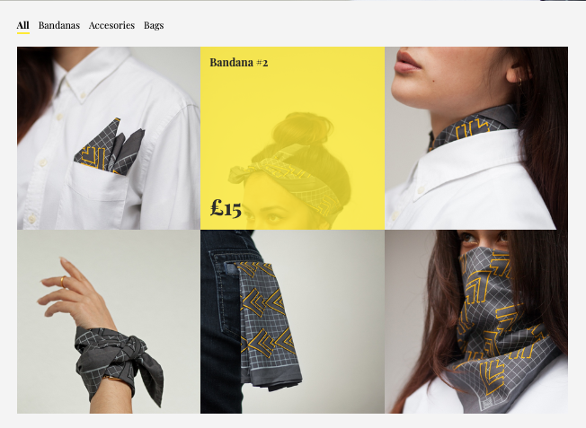

# Essmei

This site is similar to my project Hexagon-fictional-band, I decided to build a similar site to continue practicing. :computer:  
This site is responsive and contains a sort of online shop design that I have built with HTML, CSS and some Java Script. This site is built with an outter container and inner container using different styles of layout with positioning and flexbox. I use Jquery in the store section menu and every time we hovers on the objects the price and name appears.

 You can check this site [here](https://essmei-week5-4.superhi.com)
 
  
  
  
 
 

 
 
